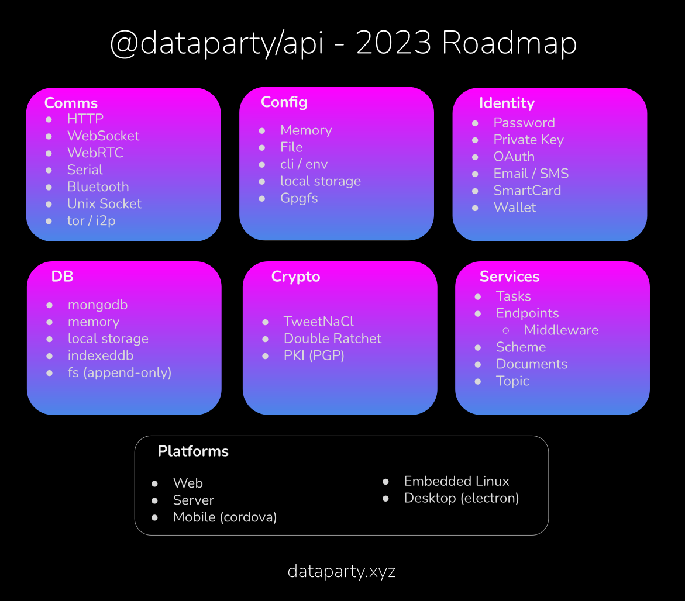

# @dataparty/api
[](http://github.com/badges/stability-badges)[](https://github.com/datapartyjs/dataparty-api/blob/master/LICENSE)

decentralized cloud framework for the Web3.0 generation.

Dataparty allows the app maker to decide how centralized or distributed they app should be and implement that vision rapidly.

 * Documentation - [datapartyjs.github.io/dataparty-api](https://datapartyjs.github.io/dataparty-api)
 * NPM - [npmjs.com/package/@dataparty/api](https://www.npmjs.com/package/@dataparty/api)
 * Code - [github.com/datapartyjs/dataparty-api](https://github.com/datapartyjs/dataparty-api)
 * Support - [ko-fi/dataparty](https://ko-fi.com/dataparty)

## Goals

The primary goal of `@dataparty/api` is to enable secure microservices development across all architectual domains with a single code base. This covers traditional clouds, peer-to-peer apps(with or without cloud backing), and hybrid clouds. Dataparty services are able to be run on servers, edge devices, or even directly in the browser or app. This means users of dataparty based apps can frequently run their own backend from with an app.


## Features

A dataparty app/service typically consists of these parts:

 * [Comms](https://datapartyjs.github.io/dataparty-api/module-Comms.html)
 * [Config](https://datapartyjs.github.io/dataparty-api/module-Config.html)
 * [Db](https://datapartyjs.github.io/dataparty-api/module-Db.html)
 * [Party](https://datapartyjs.github.io/dataparty-api/module-Party.html)
 * [Service](https://datapartyjs.github.io/dataparty-api/module-Service.html)


## Roadmap

Currently this project is considered `Experimental`, throughout 2023 we'll be working towards our first stable releases.




## Example

```

const Dataparty = require('@dataparty/api')


async function getUser(name) {
  return (await local.find()
    .type('user')
    .where('name').equals(name)
    .exec())[0]
}


async function main(){
  const dbPath = (await fs.mkdtemp('/tmp/loki-party')) + '/loki.db'

  debug('db location', dbPath)

  local = new Dataparty.LokiParty({
    path: dbPath,
    model: MyServiceModel,
    config: new Dataparty.Config.MemoryConfig()
  })


  await local.start()

  let user = await getUser('tester')

  
  if(!user){
    debug('creating document')
    user = await local.createDocument('user', {name: 'tester', created: (new Date()).toISOString() })
  }
  else{
    debug('loaded document')
  }

  console.log(user.data)


  user.data.name = 'renamed-tester'

  await user.save()

  console.log(user.data)

  let userFind = await getUser('renamed-tester')

  console.log(userFind)


  console.log(dbPath)


  await user.remove()

  console.log(await getUser('renamed-tester'))

}
```